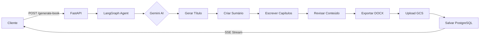

<h1 align="center">📚 Gerador de Apostilas com IA</h1>

<p align="center">
  <strong>API Backend para geração automatizada de apostilas técnicas usando Inteligência Artificial</strong>
</p>

<p align="center">
  <a href="#arquitetura">Arquitetura</a> •
  <a href="#tecnologias">Tecnologias</a> •
  <a href="#instalação">Instalação</a> •
  <a href="#configuração">Configuração</a> •
  <a href="#uso">Uso</a> •
  <a href="#api-reference">API Reference</a>
</p>

---

## 📋 Visão Geral

O **Gerador de Apostilas com IA** é uma API RESTful que automatiza a criação de material didático técnico de alta qualidade. Utilizando modelos de linguagem avançados (Google Gemini) e uma arquitetura baseada em agentes (LangGraph), o sistema gera apostilas completas com:

- ✅ **Título otimizado** baseado no tema
- ✅ **Sumário estruturado** com descrições detalhadas
- ✅ **Capítulos técnicos** com 3000+ palavras cada
- ✅ **Revisão automatizada** por IA
- ✅ **Exportação profissional** em DOCX formatado
- ✅ **Histórico de gerações** com persistência em banco de dados
- ✅ **Armazenamento em nuvem** via Google Cloud Storage

---

## 🏗️ Arquitetura

O sistema segue uma arquitetura moderna baseada em microsserviços com os seguintes componentes:


### Componentes Principais

| Componente | Descrição |
|------------|-----------|
| **FastAPI** | Framework web assíncrono para exposição dos endpoints REST |
| **LangGraph** | Orquestração do fluxo de trabalho do agente de IA |
| **Gemini AI** | Modelo de linguagem para geração de conteúdo (via API ou Vertex AI) |
| **PostgreSQL** | Banco de dados relacional para persistência de metadados |
| **Google Cloud Storage** | Armazenamento de arquivos DOCX gerados |
| **SSE (Server-Sent Events)** | Streaming de progresso em tempo real |

### Fluxo de Geração



---

## 🛠️ Tecnologias

### Core
- **Python 3.13+** - Linguagem de programação
- **FastAPI** - Framework web moderno e de alta performance
- **LangGraph** - Orquestração de agentes de IA
- **LangChain** - Abstração para LLMs

### Inteligência Artificial
- **Google Gemini API** - Modelo de linguagem generativo
- **Vertex AI** - Plataforma de IA do Google Cloud (alternativa)

### Persistência
- **PostgreSQL** - Banco de dados relacional
- **SQLAlchemy 2.0** - ORM assíncrono
- **Google Cloud Storage** - Armazenamento de objetos

### Exportação
- **python-docx** - Geração de documentos Word
- **Markdown** - Formatação de conteúdo

---

## 📁 Estrutura do Projeto

```
gerador-de-apostila-api/
├── api/
│   ├── __init__.py
│   ├── app.py            # Aplicação FastAPI e endpoints
│   ├── agent.py          # Agente LangGraph para geração
│   ├── models.py         # Schemas Pydantic
│   ├── database.py       # Configuração PostgreSQL
│   ├── db_models.py      # Modelos SQLAlchemy
│   └── storage.py        # Integração Google Cloud Storage
├── diagrams/
│   └── arquitetura.drawio.png
├── .env                  # Variáveis de ambiente (não versionado)
├── .env.example          # Template de variáveis
├── Dockerfile            # Containerização
├── pyproject.toml        # Dependências (uv/pip)
├── requirements.txt      # Dependências (pip)
└── README.md
```

---

## ⚙️ Instalação

### Pré-requisitos

- Python 3.13+
- [uv](https://docs.astral.sh/uv/) (recomendado) ou pip
- PostgreSQL (opcional, para histórico)
- Conta Google Cloud (para Vertex AI e GCS)

### Instalação com uv (Recomendado)

```bash
# Clonar repositório
git clone <repo-url>
cd gerador-de-apostila-api

# Instalar dependências
uv sync

# Executar
uv run python -m uvicorn api.app:app --host 0.0.0.0 --port 8000 --reload
```

### Instalação com pip

```bash
# Criar ambiente virtual
python -m venv .venv
source .venv/bin/activate  # Linux/Mac
.venv\Scripts\activate     # Windows

# Instalar dependências
pip install -r requirements.txt

# Executar
uvicorn api.app:app --host 0.0.0.0 --port 8000 --reload
```

### Instalação com Docker

```bash
# Build da imagem
docker build -t gerador-apostila-api .

# Executar container
docker run -p 8000:8000 --env-file .env gerador-apostila-api
```

---

## 🔧 Configuração

### Variáveis de Ambiente

Crie um arquivo `.env` na raiz do projeto:

```env
# === GEMINI AI ===
# Usar Vertex AI (true) ou Gemini API (false)
USE_VERTEXAI=false

# Gemini API (quando USE_VERTEXAI=false)
GEMINI_API_KEY=sua_chave_api
GEMINI_MODEL=gemini-2.5-flash

# Vertex AI (quando USE_VERTEXAI=true)
GOOGLE_CLOUD_PROJECT=seu_projeto
GOOGLE_CLOUD_LOCATION=us-central1
GOOGLE_APPLICATION_CREDENTIALS=/path/to/credentials.json

# === POSTGRESQL (Opcional - para histórico) ===
DB_HOST=localhost
DB_PORT=5432
DB_NAME=apostilas
DB_USER=postgres
DB_PASSWORD=sua_senha

# === GOOGLE CLOUD STORAGE (Opcional - para armazenamento) ===
GCS_BUCKET_NAME=nome-do-bucket
```

### Modos de Operação

| Modo | Descrição | Requisitos |
|------|-----------|------------|
| **Básico** | Geração local sem persistência | `GEMINI_API_KEY` |
| **Vertex AI** | Usa Vertex AI ao invés da API | `USE_VERTEXAI=true` + credenciais GCP |
| **Com Histórico** | Salva metadados no PostgreSQL | Variáveis `DB_*` configuradas |
| **Com GCS** | Armazena arquivos no Cloud Storage | `GCS_BUCKET_NAME` + credenciais |

---

## 🚀 Uso

### Acesso à Documentação

Após iniciar o servidor, acesse:

- **Swagger UI**: http://localhost:8000/docs
- **ReDoc**: http://localhost:8000/redoc

### Exemplo de Geração

```bash
curl -X POST "http://localhost:8000/generate-book" \
  -H "Content-Type: application/json" \
  -d '{
    "theme": "Introdução à Inteligência Artificial",
    "area_tecnologica": "DESENVOLVIMENTO DE SISTEMAS",
    "target_audience": "Estudantes de Tecnologia",
    "num_chapters": 5,
    "user_id": "usuario@email.com"
  }'
```

---

## 📖 API Reference

### Endpoints

#### `POST /generate-book`

Inicia o processo de geração de apostila com streaming de progresso.

**Request Body:**

```json
{
  "theme": "string (obrigatório)",
  "area_tecnologica": "string (obrigatório)",
  "target_audience": "string (obrigatório)",
  "num_chapters": "integer (1-100, default: 5)",
  "user_id": "string (opcional - para salvar no histórico)"
}
```

**Response:** `text/event-stream` (SSE)

```
data: {"type": "progress", "text": "Gerando título...", "value": 10}
data: {"type": "content", "text": "# Título do Livro\n..."}
data: {"type": "done", "value": 100, "payload": {"download_url": "/download/file.docx"}}
```

---

#### `GET /apostilas/{user_id}`

Lista todas as apostilas geradas por um usuário.

**Response:**

```json
{
  "apostilas": [
    {
      "id": "uuid",
      "title": "Título da Apostila",
      "theme": "Tema",
      "area_tecnologica": "Área",
      "num_chapters": 5,
      "created_at": "2024-01-01T00:00:00Z"
    }
  ],
  "total": 1
}
```

---

#### `GET /apostilas/{user_id}/{apostila_id}/download`

Gera URL assinada para download de uma apostila do GCS.

**Response:** `302 Redirect` para URL assinada do GCS.

---

#### `GET /download/{filename}`

Download local de arquivo (fallback quando GCS não está configurado).

**Response:** `application/vnd.openxmlformats-officedocument.wordprocessingml.document`

---

## 🔒 Segurança

- **Path Traversal Protection**: Sanitização de nomes de arquivos
- **CORS**: Configurável para produção
- **URLs Assinadas**: Expiração de 60 minutos para downloads do GCS
- **Variáveis de Ambiente**: Credenciais não são expostas no código

---

## 📊 Monitoramento

### Logs

A aplicação utiliza logging estruturado com níveis configuráveis:

```python
logging.basicConfig(level=logging.DEBUG)
```

### Health Check

```bash
curl http://localhost:8000/
# {"message": "Book Generator API is running. Go to /docs for Swagger UI."}
```

---

## 🤝 Contribuição

1. Fork o projeto
2. Crie uma branch (`git checkout -b feature/nova-feature`)
3. Commit suas mudanças (`git commit -m 'Add: nova feature'`)
4. Push para a branch (`git push origin feature/nova-feature`)
5. Abra um Pull Request

---

## 📄 Licença

Este projeto está sob a licença MIT. Veja o arquivo [LICENSE](LICENSE) para mais detalhes.

---

<p align="center">
  Desenvolvido com ❤️ para o SENAI
</p>